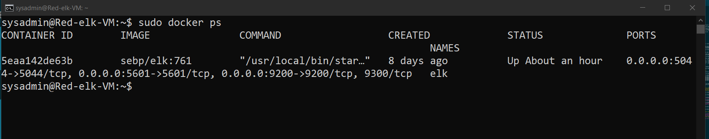
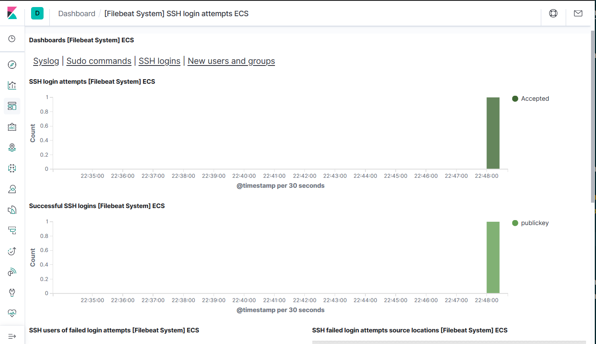
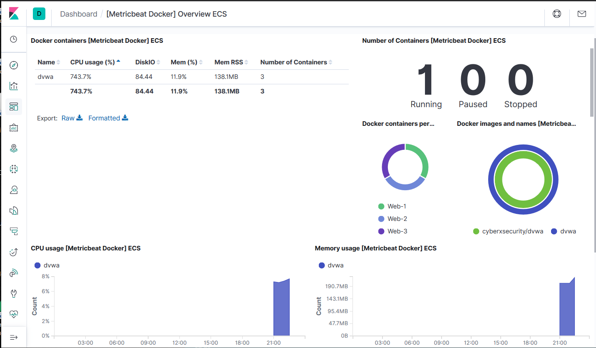

## Automated ELK Stack Deployment

The files in this repository were used to configure the network depicted below. You can also find the editable file here,  with the website https://www.draw.io/.


These files have been tested and used to generate a live ELK deployment on Azure. They can be used to either recreate the entire deployment pictured above. Alternatively, select portions of the webelkplaybook.yml file may be used to install only certain pieces of it, such as Filebeat.


This document contains the following details:
- Description of the Topology
- Access Policies
- ELK Configuration
  - Beats in Use
  - Machines Being Monitored
- How to Use the Ansible Build


### Description of the Topology

The main purpose of this network is to expose a load-balanced and monitored instance of DVWA, the D*mn Vulnerable Web Application.

Load balancing ensures that the application will be highly available, in addition to restricting bad traffic to the network. The off-loading function can help defend against DDoS attacks and also provide a secure location where admins can automate virtual server instructions and deployment.

Integrating an ELK server allows users to easily monitor the vulnerable VMs for changes to the services and system logs.

Filebeat is used to monitor log files that have been specified. They consist of mainly system logs.

Metricbeat records metrics and statistics of the servers from system and services running on the server. Since our servers are running Apache, that will be Metricbeat's main focus.

The configuration details of each machine may be found below.

| Name                 | Function   | IP Address | Operating System |
|----------------------|------------|------------|------------------|
| Jump Box Provisioner | Gateway    | 10.0.0.7   | Linux            |
| Web-1                | Web Server | 10.1.0.11  | Linux            |
| Web-2                | Web Server | 10.1.0.12  | Linux            |
| Web-3                | Web Server | 10.1.0.13  | Linux            |
| Red Elk Server       | ELK Stack  | 10.1.0.4   | Linux            |

### Access Policies

The machines on the internal network are not exposed to the public Internet. 

Only the Jump Box Provisioner machine can accept connections from the Internet. Access to this machine is only allowed from the following IP addresses:
- Local workstation's public ip of 98.117.XX.XX

Machines within the network can only be accessed by 10.0.0.7 using ansible public keys.

A summary of the access policies in place can be found in the table below.

| Name       | Publicly Accessible | Allowed IP Addresses             |
|------------|---------------------|----------------------------------|
| Jump Box   | No                  | 98.117.XXX.XXX                   |
| Web-1      | No                  | 10.0.0.7                         |
| Web-2      | No                  | 10.0.0.7                         |
| Web-3      | No                  | 10.0.0.7                         |
| Elk Server | No                  | 98.117.XXX.XXX, 10.0.0.7         |

### Elk Configuration

Ansible was used to automate configuration of the ELK machine. No configuration was performed manually, which is advantageous because it streamlines the process of manual deployment of multiple servers making it efficient and consistent with each deployment.

The playbook implements the following tasks:
- Config elk VM with Docker by increasing virtual memory, installing python module
- Download and install docker container sebp/elk:761 with associated ports
- Download and install filebeat-7.4.0-amd64.deb with config file: filebeat-config.yml
- Download and install metricbeat-7.4.0-amd64.deb with config file: metricbeat-config.yml

The following screenshot displays the result of running `docker ps` after successfully configuring the ELK instance.



### Target Machines & Beats
This ELK server is configured to monitor the following machines:
- Web-1 IP:10.0.0.11
- Web-2 IP:10.0.0.12
- Web-3 IP:10.0.0.13

We have installed the following Beats on these machines:
- Filebeat
- Metricbeat

These Beats allow us to collect the following information from each machine:
- Filebeat collects the systems log files or locations that have been specified. An example of such logs can be the monitoring of ssh connections.



-Metricbeat is used to monitor services that are running. For example, Metricbeat can monitor Docker containers and their CPU usage, Memory usage, How many are running and Network IO.



### Using the Playbook
In order to use the playbook, you will need to have an Ansible control node already configured. Assuming you have such a control node provisioned: 

SSH into the control node and follow the steps below:
- Copy the  file to /etc/ansible/roles.
- Update the hosts file to include the IP address and groups that are to be automated.
```
[webservers]
10.0.0.11 ansible_python_interpreter=/usr/bin/python3
10.0.0.12 ansible_python_interpreter=/usr/bin/python3
10.0.0.13 ansible_python_interpreter=/usr/bin/python3

[elk]
10.1.0.4 ansible_python_interpreter=/usr/bin/python3
```

- Update the filebeat-config.yml to include:
```
hosts: ["10.1.0.4:9200"] 
setup.kibana
  host: "10.1.0.4:5601"
```

- Update the metricbeat-config.yml to include:
```
setup.kibana:
  host: "10.1.0.4:5601"

output.elasticsearch:
  hosts: ["10.1.0.4:9200"]
```  

Run the playbook, and navigate to http://13.64.153.246:5601/app/kibana to check that the installation worked as expected.

You can copy the playbook here:


You update the hosts file to include the groups and server IP addresses. 

```
[webservers]
10.0.0.11 ansible_python_interpreter=/usr/bin/python3
10.0.0.12 ansible_python_interpreter=/usr/bin/python3
10.0.0.13 ansible_python_interpreter=/usr/bin/python3

[elk]
10.1.0.4 ansible_python_interpreter=/usr/bin/python3
```

Navigate to http://13.64.153.246:5601/app/kibana in order to check that the ELK server is running.

Commands download and run the playbook.
- once on Jump Box Provisioner terminal

```
sudo docker container list -a
sudo docker start <container_name>
sudo docker attach <container_name>
```

- once in Ansible container "root@xxxxx000" and all configs have been updated...

```
cd /etc/ansible/roles
curl –O https://github.com/mehtulbastro/project_13/blob/master/ansible/webelkplaybook.yml
ansible-playbook webelkplaybook.yml
```